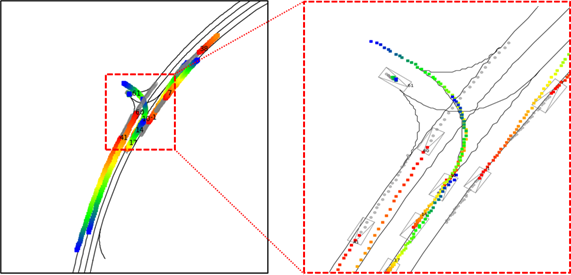
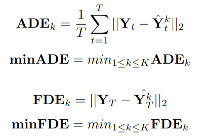

# ETRI Trajectory Dataset and Prediction Challenge 2025

This repository provides potential challenge participants with a gentle guide to ETRI trajectory prediction dataset and its corresponding devkit.

  

## ETRI Trajectory Dataset (ETD)
 
+ We acquired more than 100 driving logs, each lasting around 30 seconds and containing trajectories of our autonomous vehicle as well as its surrounding objects (e.g., vehicles, pedestrians), sampled at 10Hz in the vicinities of ETRI. We split the driving logs into two groups: one for training and the other for testing. From a log, we generated roughly 280 driving scenes, each containing 2-second observed trajectories, 6-second future trajectories, and HD map elements (e.g., lane centerlines) at a specific timestamp. As a result, we generated 17,908 scenes for training and 2,831 scenes for testing, whose format is similar to that of Argoverse2 (https://www.argoverse.org/av2.html#forecasting-link).

  
## Scene File Structure

A driving scene, stored in pkl format, is a dictionary with four keys **log_id**, **frm_idx**, **agent**, and **map**. **log_id** (_string format_) denotes the ID of the log from which the current scene is derived and **frm_idx** (_integer_) means the time step at which the AV is located currently. **agent** is a dictionary containing agents' trajectories and class information. **map** is a list of dictionaries, each containing a lane segment of HD map.

+ **agent**
    * 'num_nodes' : The number of agents in the scene.
    * 'av_index' : The identification number of the AV.
    * 'id' : A list of the agents' IDs.
    * 'type' : A numpy array of size 'num_nodes', identifying object classes of the agents. (0: vehicle, 1: pedestrian, 2: cyclist.)
    * 'position' : A numpy array of size 'num_nodes' x 80 x 3, indicating the trajectories of the agents.
    * 'heading' : A numpy array of size 'num_nodes' x 80, indicating heading directions of the agents in radians.
    * 'valid_mask' : A boolean type numpy array of size 'num_nodes' x 80, indicating whether a (x,y,z) position of an agent at a specific time step is available or not.
    * 'predict_mask' : A boolean type numpy array of size 'num_nodes' x 80, indicating whether a position of an agent at a specific time step must be predicted or not.
    * 'category' : A numpy array of size 'num_nodes', indicating categories of the agents. (0: fragmented track, 1: full track, but not to be predicted, 2: full track and to be predicted.) The prediction results of category 2 agents are only considered for the prediction performance calculation (e.g., minADE, minFDE).
    * 'wlh' : a numpy array of size 'num_nodes' x 3, indicating the width, length, and height of each agent.
    * 'num_valid_node' : The number of catetory 2 agents in the scene.

+ **map[i]**
    * 'ID' : The identification number of the lane segment.
    * 'Type' : The type of the lane segment. (0: None, 1: General Straight, 2: Intersection Straight, 3: Intersection Left, 4: Intersection Right, 5: Intersectoin U-Turn, 6: Left Pocket Lane, 7: Right Pocket Lane, 8: Unprotected Left Turn).
    * 'LLinkID' : The ID of the lane segment located left side of the current lane.
    * 'RLinkID' : The ID of the lane segment located right side of the current lane.
    * 'SNodeID' : The node ID whose position matches the start point of the lane segment.
    * 'ENodeID' : The node ID whose position matches the end point of the lane segment.
    * 'Speed' : The maximum speed limit.
    * 'Pts' : A numpy array consisting of sequential (x, y) positions and representing the lane segment.
    * 'Ori' : A numpy array of the positions' orientation (in radian).
    * 'PrvLinkID' : The lane segment ID preceding the current lane segment.
    * 'NxtLinkID' : The lane segment ID succeding the current lane segment.

## Download
Feel free to contact kimjy@etri.re.kr or d1024.choi@etri.re.kr

## Devkit
+ 'demo.py' in this repository visualizes the driving scene in a pickle file. Required libraries are described in 'libraries.py'.
+ 'argoverse2_to_qcnet_format.py' converts Argoverse2 format pickle files to the files compatible with QCNet. (https://github.com/ZikangZhou/QCNet). The original source code of QCNet is slightly modified to be trained on ETD. The training code as well as the trained network parameters will be released soon.

## Trajectory Prediction Challenge
+ The goal of this challenge is to build and train a neural network that, given 2 second observations (20 points) and HD map elements, predicts future positions of agents in a scene up to 6 seconds (60 points).
+ The models must predict at least 6 possible futures for each agent in the scene. If the number of the future predictions is greater than 6, randomly picked 6 trajectories will be used for the assessment.

  

## Evaluation Metric
Commonly used evaluation metrics are **minADE** and **minFDE**. The followings are the equations for the two metrics.

  

Here, Y_t denotes the ground-truth position at time t and hat{Y}_t^k is its k-th prediction. T and K respectively are the prediction time horizon and the number of the predictions. Note that, throughout the challenge, we set T=60, K=6. 'evaluation metrics.py' shows an example of calculating **minADE** and **minFDE** given the ground-truth trajectory and its multiple predictions.

## Submission
Given masked test samples (scene pickle files without the positions and headings of the agents over the future horizon), predict K=6 possible future trajectories for the agents in the scenes. The prediction results must be stored following the method described in 'prediction_results_submission.py'. Zip the pickle files generated by the method and submit the zip file after naming it as 'prediction_result_{participants number}.zip' (e.g., prediction_result_1024.zip). The number of the masked test samples must match the number of the pickle files generated by the method.
