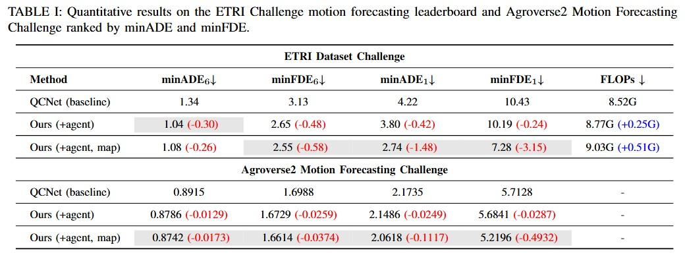
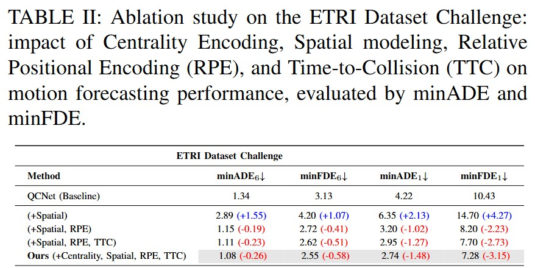
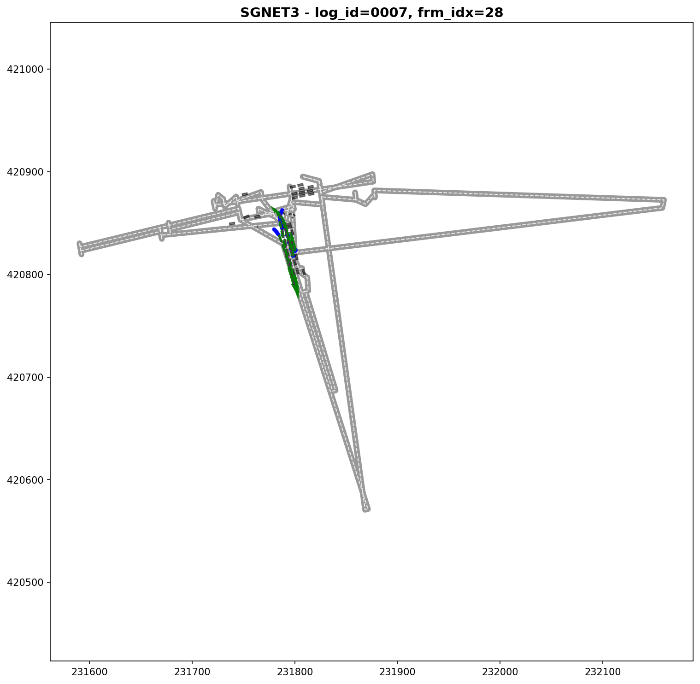
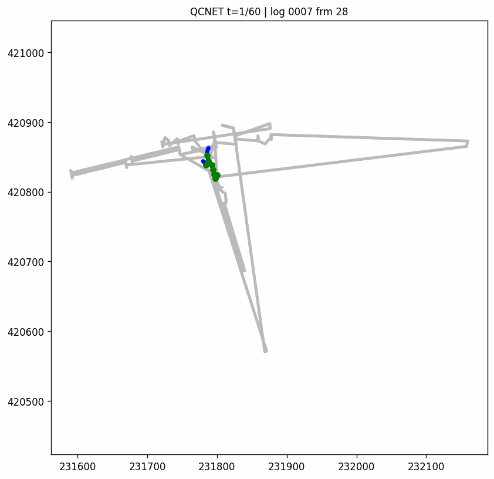
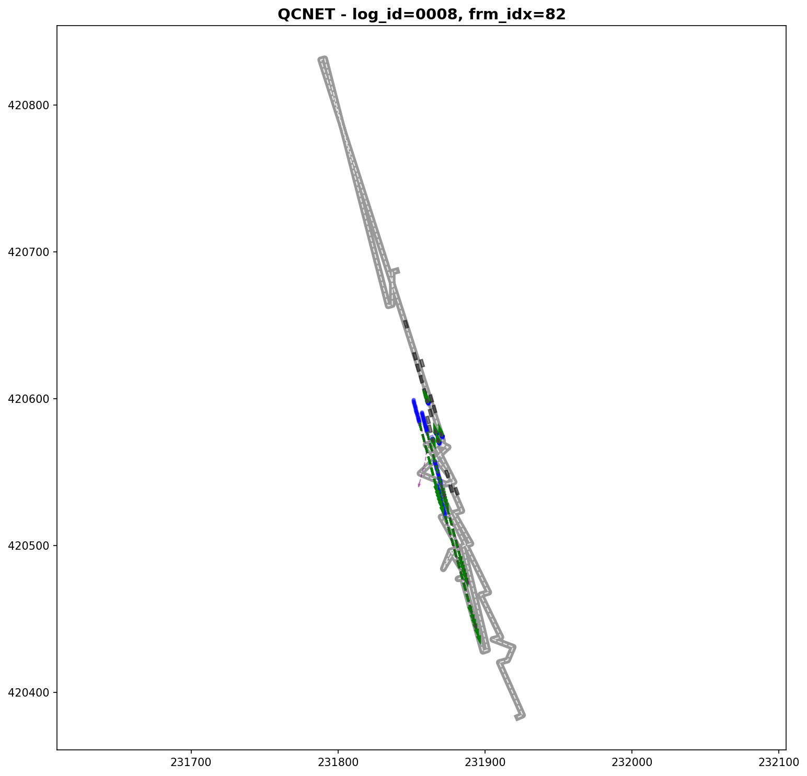
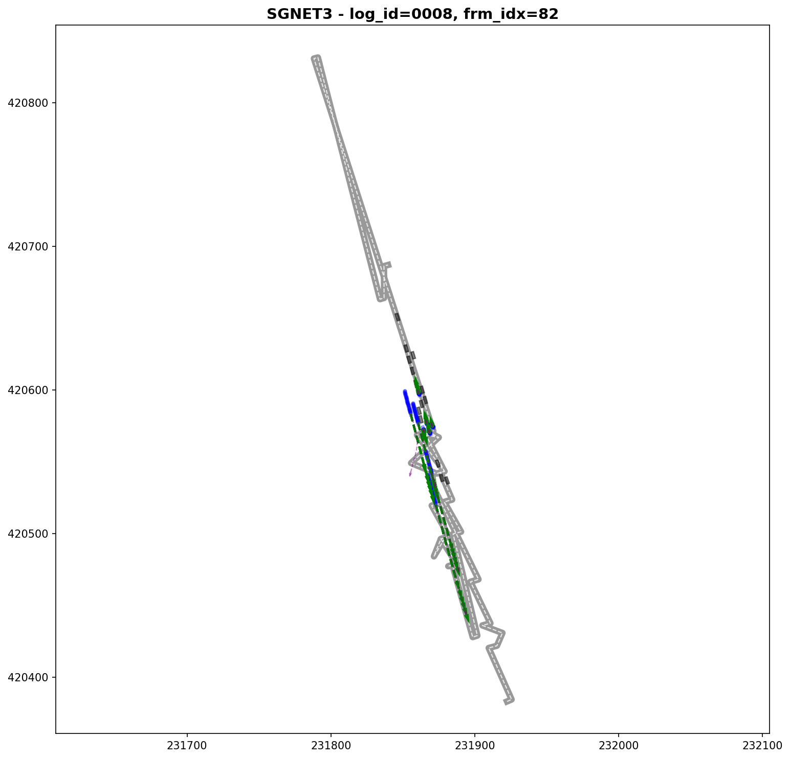
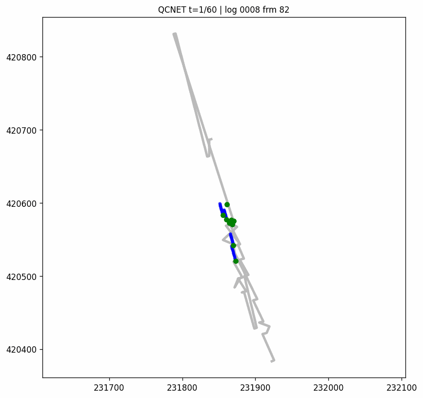

# Multi-Agent-Motion-Prediction-using-Scene-Graph

## Table of Contents
* [Getting Started](#getting-started)
* [Training & Evaluation](#training--evaluation)
* [Results](#results)
* [Citation](#citation)

## Getting Started

**Step 1**: clone this repository

**Step 2**: create a docker environment : Docker 사용법.md

**Step 3**: Download the ETRI Trajectory Dataset : 
You can download the [ETRI Trajectory Dataset](https://epretx.etri.re.kr/dataDetail?id=455).

**Step 4**: Preprocess the ETRI Trajectory Dataset : 
```
python convert_with_lists.py
```

## Training & Evaluation

### Training

I trained the model on 2 NVIDIA GeForce RTX A5000 (48G).
```
python train.py --use_graphormer 
```

**Note 1**: If you want to train QCNet baseline, you can run without `--use_graphormer`

**Note 2**: During training, the checkpoints will be saved in `wand_logs/ETRI/` automatically.

### Testing

To generate the prediction results on the test set:
```
python test.py --ckpt_path /root
```
When testing your trained model, please set --batch_size to 1 to see the average time spent per scene. Once you start testing, a folder by the name of 'version_$number$/test_results' is automatically created and the prediction results are stored in the folder.

### Visualization
 
You can visualize your predictions by running
```
python visualization.py
```

### Evaluation

If you want to evaluate your model, you can submit to [KADIF Challenge Leaderboard](https://dxchallenge.ai.kr/submissions)

## Results

### Quantitative Results





### Qualitative Results

#### log0007_0000028

| QCNet | Ours |
|  |  |
|  |  |

#### log0008_0000082

| QCNet | Ours |
|  |  |
|  |  |

## Citation

This repository is developed based on our previous codebase [Query-Centric Trajectory Prediction](https://github.com/ZikangZhou/QCNet)
Please also consider citing:
```
@inproceedings{zhou2023query,
  title={Query-Centric Trajectory Prediction},
  author={Zhou, Zikang and Wang, Jianping and Li, Yung-Hui and Huang, Yu-Kai},
  booktitle={Proceedings of the IEEE/CVF Conference on Computer Vision and Pattern Recognition (CVPR)},
  year={2023}
}
```

```
@article{zhou2023qcnext,
  title={QCNeXt: A Next-Generation Framework For Joint Multi-Agent Trajectory Prediction},
  author={Zhou, Zikang and Wen, Zihao and Wang, Jianping and Li, Yung-Hui and Huang, Yu-Kai},
  journal={arXiv preprint arXiv:2306.10508},
  year={2023}
}
```
